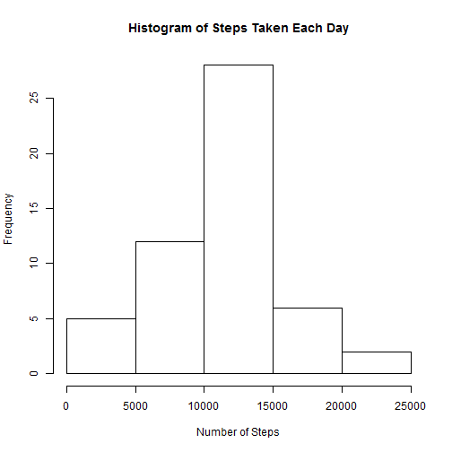
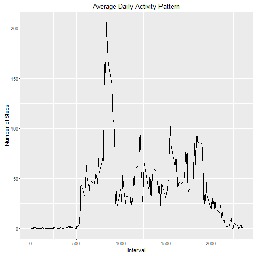
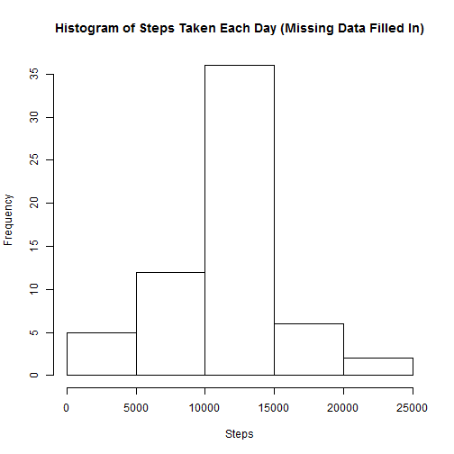
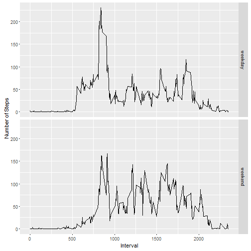

```{r}
knitr::opts_chunk$set(echo = TRUE, warning = FALSE)
```

## Loading and preprocessing the data
```{r}
if (! file.exists("./project")) {dir.create("./project")}
fileUrl <- "https://d396qusza40orc.cloudfront.net/repdata%2Fdata%2Factivity.zip"
download.file(fileUrl, destfile = "./project/activity.zip")
unzip("./project/activity.zip", exdir = "./project")
activity <- read.csv("./project/activity.csv")
activity$date <- as.Date(activity$date, "%Y-%m-%d")
str(activity)
```

```
## 'data.frame':	17568 obs. of  3 variables:
##  $ steps   : int  NA NA NA NA NA NA NA NA NA NA ...
##  $ date    : Date, format: "2012-10-01" "2012-10-01" ...
##  $ interval: int  0 5 10 15 20 25 30 35 40 45 ...
```

## What is mean total number of steps taken per day?
```{r}
dayStep <- tapply(activity$steps, activity$date, sum)
hist(dayStep, main = "Histogram of Steps Taken Each Day", xlab = "Number of Steps")
```


```{r}
meanStep <- mean(tapply(activity$steps, activity$date, sum), na.rm = TRUE)
meanStep
```

```
## [1] 10766.19
```


```{r}
medianStep <- median(tapply(activity$steps, activity$date, sum), na.rm = TRUE)
medianStep
```

```
## [1] 10765
```

The mean of the total number of steps taken per day is r meanStep, the median of the total number of steps taken per day is r medianStep.

## What is the average daily activity pattern?
```{r}
library(dplyr)
```
```
## 
## Attaching package: 'dplyr'
```

```
## The following objects are masked from 'package:stats':
## 
##     filter, lag
```

```
## The following objects are masked from 'package:base':
## 
##     intersect, setdiff, setequal, union
```

```{r}
library(ggplot2)
pattern <- activity %>%
        group_by(interval) %>%
        summarise(avg_steps = mean(steps, na.rm = TRUE))
g1 <- ggplot(pattern, aes(interval, avg_steps))
g1 + geom_line() + labs(title = "Average Daily Activity Pattern") + labs(x = "Interval", y = "Number of Steps")
```


```{r}
maxStep <- max(pattern$avg_steps)
maxStep
```

```
## [1] 206.1698
```

```{r}
maxInterval <- pattern$interval[match(maxStep, pattern$avg_steps)]
maxInterval
```

```
## [1] 835
```

The maximum number of steps is r maxStep steps.

## Imputing missing values
```{r}
NAcount <- sum(is.na(activity$steps))
NAcount
```

```
## [1] 2304
```

```{r}
activity_new <- mutate(activity, int_avg = factor(interval, pattern$interval, labels = pattern$avg_steps))
for (i in 1:nrow(activity_new)) {
        if (is.na(activity_new$steps[i])) {
                activity_new$steps[i] <- as.numeric(as.character(activity_new$int_avg[i]))
        }
}
```

In the dataset, there are r NAcount missing valuesin total. By using the mean for each 5-minute interval to replace the NAs, we can thus create a new dataset called activity_new.

```{r}
dayStep_new <- tapply(activity_new$steps, activity_new$date, sum)
hist(dayStep_new, main = "Histogram of Steps Taken Each Day (Missing Data Filled In)", xlab = "Steps")
```



```{r}
meanStep_new <- mean(tapply(activity_new$steps, activity_new$date, sum), na.rm = TRUE)
meanStep_new
```

```
## [1] 10766.19
```

The mean total number of steps taken per day is not affected by imputing missing data.

```{r}
medianStep_new <- median(tapply(activity_new$steps, activity_new$date, sum), na.rm = TRUE)
medianStep_new
```

```
## [1] 10766.19
```

The median total number of steps taken per day is infuenced, now it equals to the mean value. 


## Are there differences in activity patterns between weekdays and weekends?
```{r}
library(lubridate)
```

```
## 
## Attaching package: 'lubridate'
```

```
## The following object is masked from 'package:base':
## 
##     date
```
```{r}
activity_new$wday <- wday(activity_new$date)
activity_new$group[activity_new$wday[] == 1 | activity_new$wday[] == 7] <- "weekend"
activity_new$group[activity_new$wday[] >= 2 & activity_new$wday[] <= 6] <- "weekday"
activity_new$group <- as.factor(activity_new$group)
str(activity_new)
```

```
## 'data.frame':	17568 obs. of  6 variables:
##  $ steps   : num  1.717 0.3396 0.1321 0.1509 0.0755 ...
##  $ date    : Date, format: "2012-10-01" "2012-10-01" ...
##  $ interval: int  0 5 10 15 20 25 30 35 40 45 ...
##  $ int_avg : Factor w/ 288 levels "1.71698113207547",..: 1 2 3 4 5 6 7 8 9 10 ...
##  $ wday    : num  2 2 2 2 2 2 2 2 2 2 ...
##  $ group   : Factor w/ 2 levels "weekday","weekend": 1 1 1 1 1 1 1 1 1 1 ...
```

We create a new factor variable, group to indicate whether the given date is a weekday or on weekend.

```{r}
        group_by(group, interval) %>%
        summarise(group_avg = mean(steps))
g2 <- ggplot(groupData, aes(interval, group_avg))
g2 + geom_line() + facet_grid(group~.) + labs(x = "Interval", y = "Number of Steps")
```



From the panel plot, the number of steps on weekday has a peak in the morning; While on weekends, there is no obvious peak.
